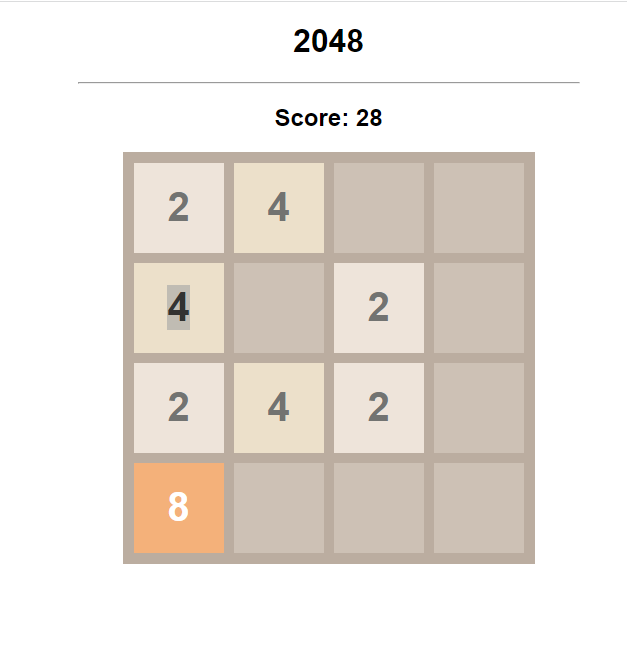

## Game 1: 2048

### Description

2048 is a popular puzzle game where the objective is to slide numbered tiles on a grid to combine them and create a tile with the number 2048. The game starts with two tiles of either 2 or 4, and the player can use arrow keys to move the tiles in four directions (up, down, left, or right). When two tiles with the same number collide, they merge into one, doubling the value. The goal is to reach the 2048 tile by strategically moving and merging the tiles.

### Technologies Used

- HTML: Used for creating the structure and layout of the game.
- CSS: Used for styling the game interface and making it visually appealing.
- JavaScript (Vanilla JS): Used for implementing the game logic, handling user input, updating the grid, checking for game over conditions, and managing the scoring system.

### Preview

To play the game, simply open the `index.html` file in a web browser. Use the arrow keys to move the tiles and try to reach the 2048 tile. The current score is displayed on the screen.

## How to Run the Game

1. Clone this repository to your local machine.
2. Open the desired game folder.
3. Open the `index.html` file in a web browser.
4. Enjoy playing the game!

